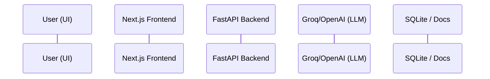

# ParcelPilot AI Support System
```
A production-grade, multi-agent support system and proactive analytics dashboard built for ParcelPilot. This project solves critical customer support challenges by combining retrieval-augmented generation (RAG) with strict data-layer access controls (RBAC) and human-in-the-loop action execution.
```
## 🌟 Core Features
```
- **Multi-Source RAG with Trust Hierarchy**: Intelligently resolves conflicts between general Support Policies, specific SOPs, and custom Enterprise Agreements (e.g., Northstar vs. LumenWorks). Explicitly ignores deprecated policies.
- **Data-Layer Security (RBAC)**: Context-aware data access. The user_context strictly limits which documents, orders, and tickets the AI can access at the SQL query level, preventing cross-tenant data leakage.
- **Proactive Insights Dashboard**: A real-time analytics dashboard that scans incoming tickets to detect anomalies (like spikes in CSV upload failures) and flags SLA risks before they escalate.
- **Human-in-the-Loop Actions**: State-changing actions (like granting service credits or cancelling orders) are securely prepared by the AI but require explicit human confirmation via the UI before executing.
- **Execution Transparency**: The UI surfaces exactly which tools and documents the AI used to generate its response, building trust with support agents.
```
---
```
## 🏗️ Architecture Note
```


    U->>F: Sends message & user_context
    F->>B: POST /api/chat
    B->>LLM: Start Agent Loop (Prompt + Context)
    
    loop Max 5 Turns
        LLM->>B: Request Tool Call
        
        alt search_documents
            B->>DB: Scan .txt with Trust Rules
        else lookup_order / ticket
            B->>DB: SELECT ... WHERE account_id = ?
            Note over B,DB: 🔒 RBAC enforced at SQL layer
        else prepare_action
            B-->>F: Return Action Payload
            Note over U,F: 🛑 Requires Human Confirmation
        end
        
        DB-->>B: Return Data
        B->>LLM: Send Tool Results
    end
    
    LLM-->>B: Final Text Response
    B-->>F: Send Final Reply & Tool Logs
    F-->>U: Render Chat & Tool Execution UI
```
```

The system is built on a modern, decoupled architecture:
- **Frontend**: Next.js (React), TailwindCSS, and Lucide Icons. Features a split-pane design with a real-time chat interface and a proactive Insights Dashboard.
- **Backend**: FastAPI (Python). Provides robust API endpoints for chat, action execution, and dashboard analytics.
- **Database**: SQLite. Acts as the system of record for tickets, orders, and the ction_log.
- **AI Agent Engine**: A custom iterative tool-calling loop utilizing the OpenAI SDK (configured for Groq's open-source models).
```
**Key Architectural Decision: SQL-Level RBAC over Prompt Engineering**
To satisfy Problem 2 (Data Security), we consciously decided *not* to rely on prompt engineering to hide data. Instead, the user_context is passed directly into the SQL tool functions (lookup_ticket, lookup_order). If "LumenWorks" tries to access a "Northstar" order, the SQL query strictly filters by ccount_id, returning a hard failure to the AI. This guarantees tenant isolation regardless of LLM hallucinations.
```
---
```
## 🚀 Product Note
```
The ParcelPilot AI system is designed with two distinct user personas in mind:
1. **The End-Customer (e.g., Northstar)**: Needs immediate, accurate answers regarding cancellation fees and service credits based on their *specific* enterprise agreements, not just generic SOPs.
2. **The Internal Support Team**: Needs to manage high ticket volumes, escalate critical API issues, and identify platform-wide anomalies (like carrier faults) proactively.
```
**Solving the Trust Problem**
Support agents often mistrust AI because it's a "black box." We solved this (Problem 5) by explicitly rendering the AI's tool execution chain in the UI. When the AI answers a cancellation question, the agent can see it actively triggered search_documents (Northstar Agreement) and lookup_order. Furthermore, by requiring human confirmation for actions (Problem 3), we empower agents rather than replacing them.
```
---
```
## ⚖️ Trade-offs & Future Scope
```
| Feature | Current Trade-off | Future Implementation |
|---------|-------------------|-----------------------|
| **Vector Search** | Currently using keyword relevance scoring for text documents to minimize infrastructure overhead. | Migrate to a vector database (like Chroma or Qdrant) with embeddings for semantic RAG retrieval. |
| **Authentication** | user_context is currently mocked via a UI selector for demonstration purposes. | Implement JWT-based Auth (e.g., NextAuth or Firebase) where user_context is securely derived from the token. |
| **Database** | SQLite is used for portability and ease of setup during the assessment. | Migrate to PostgreSQL (via Supabase or RDS) for concurrent writes and horizontal backend scaling. |
| **Action Execution** | Actions are currently logged to an ction_log table. | Integrate with actual 3rd-party APIs (Stripe for refunds, Zendesk for ticket mutations). |
```
---
```
## 🤖 AI Tool Usage
```
As required by the assessment guidelines, here is a disclosure of AI tooling used during development:
- **Google Antigravity (Agentic AI)**: Used extensively for architectural planning, scaffolding the FastAPI backend, debugging Next.js hydration issues, and implementing the multi-turn tool-calling loop.
- The AI was particularly instrumental in designing the structured JSON schemas for tool-calling and generating the regex logic for the keyword relevance RAG implementation.
```
---
```
## 💻 Local Setup & Deployment
```
### Prerequisites
- Node.js v18+
- Python 3.10+
- Groq API Key
```
### Backend Setup (FastAPI)
\\\ash
cd backend
python -m venv venv
source venv/bin/activate  # Or env\Scripts\activate on Windows
pip install -r requirements.txt
\\\
Create a .env file in the ackend directory:
\\\env
OPENAI_API_KEY=your_groq_api_key_here
OPENAI_BASE_URL=https://api.groq.com/openai/v1
MODEL_NAME=openai/gpt-oss-120b
\\\
Start the server:
\\\ash
uvicorn main:app --host 0.0.0.0 --port 8001
\\\
```
### Frontend Setup (Next.js)
\\\ash
cd frontend
npm install
\\\
Create a .env.local file in the rontend directory:
\\\env
NEXT_PUBLIC_API_URL=http://localhost:8001
\\\
Start the frontend:
\\\ash
npm run dev
\\\
```
The application will be available at http://localhost:3000.
